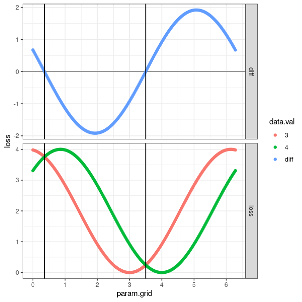

# 3 Mar 2024

Modified robseg [figure-robseg.R](figure-robseg.R)
https://github.com/tdhock/robust-fpop/tree/interval-count shows that
number of intervals is indeed linear if penalty is large.

```
      lambda lthreshold lslope intervals  path
       <num>      <num>  <num>     <int> <int>
   1:    100          1      0         3    -1
   2:    100          1      0         5    -1
   3:    100          1      0         7    -1
   4:    100          1      0         9    -1
   5:    100          1      0        11    -1
  ---                                         
 996:    100          1      0       724    -1
 997:    100          1      0       722    -1
 998:    100          1      0       724    -1
 999:    100          1      0       723    -1
1000:    100          1      0       726    -1
      lambda lthreshold lslope intervals  path
       <num>      <num>  <num>     <int> <int>
   1:    0.1          1      0         3    -1
   2:    0.1          1      0         5     1
   3:    0.1          1      0         5     2
   4:    0.1          1      0         5     3
   5:    0.1          1      0         5     4
  ---                                         
 996:    0.1          1      0         5   994
 997:    0.1          1      0         6   996
 998:    0.1          1      0         6   995
 999:    0.1          1      0         7   998
1000:    0.1          1      0         5   999
      lambda lthreshold lslope intervals  path
       <num>      <num>  <num>     <int> <int>
   1:    100          0     -1         3    -1
   2:    100          0     -1         5    -1
   3:    100          0     -1         7    -1
   4:    100          0     -1         9    -1
   5:    100          0     -1        11    -1
  ---                                         
 996:    100          0     -1       787    -1
 997:    100          0     -1       786    -1
 998:    100          0     -1       788    -1
 999:    100          0     -1       787    -1
1000:    100          0     -1       788    -1
      lambda lthreshold lslope intervals  path
       <num>      <num>  <num>     <int> <int>
   1:    0.1          0     -1         3    -1
   2:    0.1          0     -1         7     1
   3:    0.1          0     -1         7     2
   4:    0.1          0     -1         7     3
   5:    0.1          0     -1         7     4
  ---                                         
 996:    0.1          0     -1         7   995
 997:    0.1          0     -1         7   996
 998:    0.1          0     -1         7   997
 999:    0.1          0     -1         7   998
1000:    0.1          0     -1         7   999
```

# 29 Feb 2024

[figure-min-l1-2d.R](figure-min-l1-2d.R) makes


# 23 Feb 2024

[avocados.py](avocados.py) reads avocados/data_1.pkl etc and saves
avocados/trajectory1458/25.csv.gz etc.

# 7 Feb 2024

For functional pruning L2 loss in sin/cos space, we can use this
formula for finding the intersection of two loss functions
https://www.wolframalpha.com/input?i=a%2Bb*sin%28x%29%2Bc*cos%28x%29%3D0

[figure-loss.R](figure-loss.R) makes


[figure-roots-sin-cos.R](figure-roots-sin-cos.R) makes



[figure-roots-l1-2d.R](figure-roots-l1-2d.R) makes


